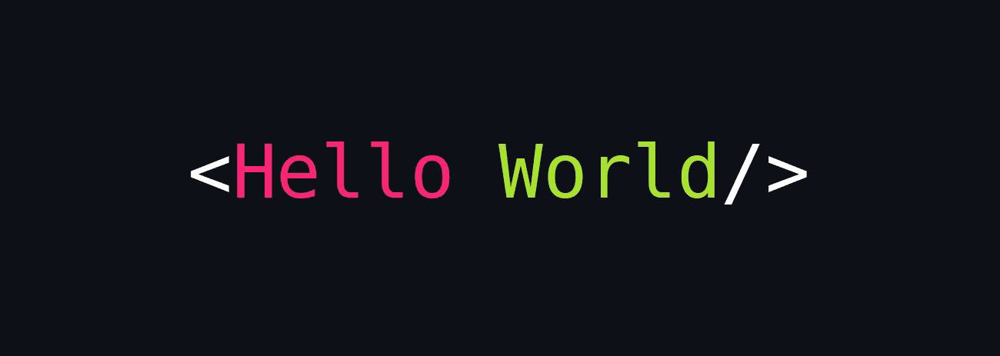

  
  
### 
Hi, I'm Marius, Full Stack Developer
  
  

- 📆 Recently I finished my advanced training to become a Full Stack Web Developer at [Super(code)](https://www.super-code.de/) 

- 🔭 Currently I'm learning Java☕️ while working at [Capco Solution Services](https://www.capco.com/) as an "Full-Stack developer"

- ❓ Ask me about anything related to MERN stack and related technologies  

- 🌐 Visit my Portfolio -> [mariuselting.dev](https://mariuselting.dev/)  

  

   

## My Skill Set  
<table align="center"><tr><td valign="top" width="33%">

### Frontend  

  
  
  
  
  
    
  
  

</td><td valign="top" width="33%">

### Backend  

  
  
  
  
  

</td><td valign="top" width="33%">

### Additional  

  
  
  
 
   
     

</td></tr></table>  

   

## Connect with me  

  
    

  
  

   

## Github Stats  
  
  
 

  

   

  ## Meme

  
  

  
